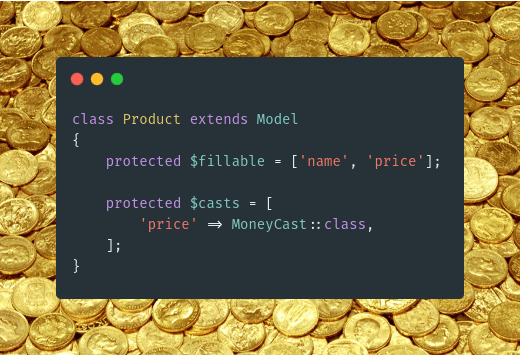

# PHP Laravel Money Package



[](https://github.com/andriichuk/laracash)
[](https://packagist.org/packages/andriichuk/laracash)
[](https://packagist.org/packages/andriichuk/laracash)
[](https://packagist.org/packages/andriichuk/laracash)
[](https://packagist.org/packages/andriichuk/laracash)
[](https://packagist.org/packages/andriichuk/laracash)

* Laravel wrapper over the [MoneyPHP](https://github.com/moneyphp/money) library
* Provides a convenient way to work with the money column as a Value Object
* Uses the [Custom Casts](https://laravel.com/docs/7.x/eloquent-mutators#custom-casts) Laravel 7.x feature 

# Table of Contents

* [Features](#features)
* [Requirements](#requirements)
* [Installation](#installation)
* Supported concepts
    * [Money columns with default Currency (without a specific column)](#money-columns-with-default-currency)
    * [Currency columns without Money](#currency-columns-without-money)
    * [Multiple Money columns refer to one Currency column](#multiple-money-columns-refer-to-one-currency-column)
    * [Money to Currencies columns mapping](#money-to-currencies-columns-mapping)
* [Display money data in the form input field](#display-money-data-in-the-form-input-field)
* [Parse money from request field](#parse-money-from-request-field)
* [Using in API resources](#using-in-api-resources)
* [Model creation](#model-creation)
* [Bitcoin creation](#bitcoin-creation)
* [Retrieving data](#retrieving-data)
* [Operations](#operations)
* Library API
    * [Creation](#creation)
    * [Formatting](#formatting)
    * [Bitcoin](#bitcoin)
    * [Parsing](#parsing)

### Features

* Convenient work with the native the MoneyPHP library and Laravel Eloquent ORM
* Money columns casting
* Currencies columns casting
* Supported concepts
    * Money columns with default Currency (without a specific column)
    * Currency columns without Money
    * Many Money columns reference to one Currency column
    * Money to Currencies columns mapping

### Requirements

* PHP ^8.0
* Laravel v7.x|v8.x

Suggest

* BCMath (`ext-bcmath`) and GMP (`ext-gmp`) PHP Extensions for calculations with large integers
* Intl PHP Extension (`ext-intl`) for formatting

### Installation

Require package

```shell script
composer require andriichuk/laracash
```

Publish vendor settings

```shell script
php artisan vendor:publish --provider="Andriichuk\Laracash\ServiceProviders\LaracashServiceProvider" --tag="config"
```

Default settings

```php
[
    'currency' => 'USD',
    'locale' => 'en_US',
]
```

### Usage Concepts

#### Money columns with default Currency

```php
<?php

namespace App;

use Andriichuk\Laracash\Casts\MoneyCast;
use Illuminate\Database\Eloquent\Model;
use Money\Money;

/**
 * Class OrderItem
 *
 * @property Money $price
 * @property Money $discount
 */
class OrderItem extends Model
{
    protected $fillable = ['name', 'price', 'discount'];

    protected $casts = [
        'price' => MoneyCast::class,
        'discount' => MoneyCast::class,
    ];
}
```

```php
OrderItem::create([
    'name' => 'Order Item',
    'price' => makeMoney(1000),
    'discount' => makeMoney(15),
]);
```

#### Currency columns without Money

```php
<?php

namespace App;

use Andriichuk\Laracash\Casts\CurrencyCast;
use Andriichuk\Laracash\Model\HasCurrency;
use Andriichuk\Laracash\Model\HasCurrencyInterface;
use Illuminate\Database\Eloquent\Model;
use Money\Currency;

/**
 * Class Rate
 *
 * @property Currency $currency
 */
class Rate extends Model implements HasCurrencyInterface
{
    use HasCurrency;

    protected $fillable = ['name', 'price', 'currency', 'native_currency'];

    protected $casts = [
        'currency' => CurrencyCast::class,
        'native_currency' => CurrencyCast::class,
    ];
}
```

```php
Rate::create([
    'name' => 'Rate #1', 
    'price' => 99, 
    'currency' => new Currency('USD'), 
    'native_currency' => 'UAH',
]);
```

### Multiple Money columns refer to one Currency column

```php
use Andriichuk\Laracash\Casts\CurrencyCast;
use Andriichuk\Laracash\Casts\MoneyCast;
use Andriichuk\Laracash\Model\HasCurrency;
use Andriichuk\Laracash\Model\HasMoneyWithCurrency;
use Andriichuk\Laracash\Model\HasMoneyWithCurrencyInterface;
use Illuminate\Database\Eloquent\Model;
use Money\Currency;
use Money\Money;

/**
 * Class Transaction
 *
 * @property Money $payment_amount
 * @property Money $discount
 * @property Currency $currency
 */
class Transaction extends Model implements HasMoneyWithCurrencyInterface
{
    use HasMoneyWithCurrency;
    use HasCurrency;

    protected $fillable = ['name', 'payment_amount', 'discount', 'currency'];

    protected $casts = [
        'payment_amount' => MoneyCast::class,
        'discount' => MoneyCast::class,
        'currency' => CurrencyCast::class,
    ];

    public function getCurrencyColumnFor(string $field): string
    {
        return 'currency';
    }
}
```
> If the currency is in a related model, just return an empty string (`''`) in `getCurrencyColumnFor()`.

#### Money to Currencies columns mapping

```php
use Andriichuk\Laracash\Casts\CurrencyCast;
use Andriichuk\Laracash\Casts\MoneyCast;
use Andriichuk\Laracash\Model\HasCurrency;use Andriichuk\Laracash\Model\HasMoneyWithCurrency;
use Andriichuk\Laracash\Model\HasMoneyWithCurrencyInterface;
use Illuminate\Database\Eloquent\Model;
use Money\Currency;
use Money\Money;

/**
 * Class Product
 *
 * @property Money $payment_amount
 * @property Money $discount
 * @property Currency $currency
 */
class Product extends Model implements HasMoneyWithCurrencyInterface 
{
    use HasMoneyWithCurrency;
    use HasCurrency;

    protected $fillable = ['name', 'price', 'currency', 'book_price', 'native_currency'];

    protected $casts = [
        'price' => MoneyCast::class,
        'currency' => CurrencyCast::class,

        'book_price' => MoneyCast::class,
        'native_currency' => CurrencyCast::class
    ];

    public function getCurrencyColumnFor(string $field): string
    {
        return [
            'price' => 'currency',
            'book_price' => 'native_currency',
        ][$field] ?? '';
    }
}
```

```php
Product::create([
    'price' => \Money\Money::USD(1000),
    'book_price' => Money::UAH(25000),
]);
```

If you want to use magic accessors (`*_as_currency`, `*_as_decimal`) for money fields then you should add `HasMoney` trait to your Eloquent Model (accessors will be added automatically)

```php
<?php

namespace App;

use Andriichuk\Laracash\Casts\MoneyCast;
use Andriichuk\Laracash\Model\HasMoney;
use Illuminate\Database\Eloquent\Model;
use Money\Money;

/**
 * Class Product
 *
 * @property Money $price
 * @property-read string $price_as_currency
 * @property-read string $price_as_decimal
 */
class Product extends Model
{
    use HasMoney;

    protected $fillable = ['name', 'price'];

    protected $casts = [
        'price' => MoneyCast::class,
    ];
}
```

Now you can call magic fields

```php
use App\Product;

$product = Product::find(1);

$product->price_as_decimal; // "10.00"
$product->price_as_currency; // "$10.00"

$product->price = 5000;

$product->price_as_decimal; // "50.00"
$product->price_as_currency; // "$50.00"
```

### Display money data in the form input field

Assign model

```php
use App\Product;
use Illuminate\Support\Facades\Route;

Route::view('/', 'productForm', ['product' => Product::find(1)]);
```

Present money object as a decimal value

```blade
<input type="number" name="price" value="{{ formatMoneyAsDecimal($product->price) }}">

{{-- or with magic syntax --}}
<input type="number" name="price" value="{{ $product->price_as_decimal }}">
```

### Parse money from request field

```php

use App\Product;
use Illuminate\Http\Request;
use Illuminate\Support\Facades\Route;

Route::post('products/{product}', function (Product $product, Request $request) {
    $product->price = parseMoneyDecimal($request->get('price')); // 55.99 => Money::USD(5599)
});
```

### Using in API resources

Define model resource

```php
use App\Product;
use Illuminate\Http\Resources\Json\JsonResource;

/**
 * Class ProductResource
 *
 * @mixin Product
 */
final class ProductResource extends JsonResource
{
    public function toArray($request): array
    {
        return [
            'id' => $this->id,
            'name' => $this->name,
            'price' => $this->price,
            'price_as_currency' => $this->price_as_currency, // or formatMoneyAsCurrency($this->price)
        ];
    }
}
```

Apply resource to the model

```php
use App\Product;
use App\Http\Resources\ProductResource;

Route::get('products/{product}', function (Product $product) {
    return new ProductResource($product);
});
```

Output

```json
{
  "data": {
    "id": 1,
    "name": "Product name",
    "price": {
      "amount": "1000",
      "currency": "USD"
    },
    "price_as_currency": "$10.00"
  }
}
```

### Model Creation

Using scalar values (int|string)

```php
use App\Product;

Product::create([
    'name' => 'The First Product',
    'price' => 100,
]);
```

Using `Money\Money` object:

```php
use App\Product;
use Money\Money;

Product::create([
    'name' => 'The Second Product',
    'price' => Money::USD(100),
]);
```

Using facade:

```php
use Andriichuk\Laracash\Facades\Laracash;
use App\Product;

Product::create([
    'name' => 'The Third Product',
    'price' => Laracash::factory()->make(100)
]);
```

Using helper function:

```php
use App\Product;

Product::create([
    'name' => 'The Fourth Product',
    'price' => makeMoney(100)
]);
```

### Bitcoin creation

```php
use Andriichuk\Laracash\Facades\Laracash;
use Money\Money;

// Using Facade
Laracash::factory()->makeBitcoin(1000000000);

// Using helper
makeBitcoin(1000000000);

// Using native library factory call
Money::XBT(1000000000);
```

### Retrieving data

```php
use App\Product;

$product = Product::find(1);

dd($product->price);
```

```text
Money\Money {#403 ▼
  -amount: "1000"
  -currency: Money\Currency {#404 ▼
    -code: "USD"
  }
}
```

### Operations

Check original library [docs](http://moneyphp.org/en/stable/features/operation.html) for more information

```php
use Andriichuk\Laracash\Facades\Laracash;
use App\Product;

$product = Product::find(1);

$product->price = $product->price->add(Laracash::factory()->make(2000));

$product->save();
```

### API

#### Creation

Money instance creation using `Laracash` facade.

*If you do not pass the second argument `currency`, then it will take from `config` file

```php
use \Andriichuk\Laracash\Facades\Laracash;

Laracash::factory()->make(1000);
Laracash::factory()->make('10000000000000');
```

Specify currency

```php
use \Andriichuk\Laracash\Facades\Laracash;
use \Money\Currency;

Laracash::factory()->make(1000, 'USD');
Laracash::factory()->make(1000, new Currency('USD'));

// Or use native method Money::USD(100)
```

```text
Money\Money {#403 ▼
  -amount: "1000"
  -currency: Money\Currency {#404 ▼
    -code: "USD"
  }
}
```

#### Formatting

Money instance formatting. [More info](http://moneyphp.org/en/stable/features/formatting.html)

Decimal

```php
use \Andriichuk\Laracash\Facades\Laracash;
use Money\Money;

Laracash::formatter()->formatAsDecimal(Money::USD(100)); // "1.00"
formatMoneyAsDecimal(Money::USD(100)); // "1.00"
```

Using `Intl` extension

```php
use \Andriichuk\Laracash\Facades\Laracash;
use Money\Money;

Laracash::formatter()->formatAsIntlDecimal(Money::USD(100)); // "1"
Laracash::formatter()->formatAsIntlDecimal(Money::USD(100), 'uk_UA'); // "1"
```

`Intl` currency

```php
use \Andriichuk\Laracash\Facades\Laracash;
use Money\Money;

Laracash::formatter()->formatAsIntlCurrency(Money::USD(100)); // "$1.00"
Laracash::formatter()->formatAsIntlCurrency(Money::USD(100), 'uk_UA'); // "1,00 USD"
formatMoneyAsCurrency(Money::USD(100)); // "$1.00"
formatMoneyAsCurrency(Money::XBT(1000000000)); // "Ƀ10.00"
```

Specify custom `Intl` formatting style

```php
use \Andriichuk\Laracash\Facades\Laracash;
use Money\Money;
use NumberFormatter;

Laracash::formatter()->formatIntlWithStyle(Money::USD(100), 'en_US', NumberFormatter::SPELLOUT); // "one"
Laracash::formatter()->formatIntlWithStyle(Money::USD(100), 'en_US', NumberFormatter::SCIENTIFIC); // "1E0"
```

Bitcoin

```php
use \Andriichuk\Laracash\Facades\Laracash;
use Money\Money;

Laracash::formatter()->formatBitcoin(Money::XBT(1000000000)); // "Ƀ10.00"

// or use helper function
formatMoneyAsCurrency(makeBitcoin(1000000000)); // "Ƀ10.00"
```

Bitcoin as decimal

```php
use \Andriichuk\Laracash\Facades\Laracash;
use Money\Money;

Laracash::formatter()->formatBitcoinAsDecimal(Money::XBT(1000000000)); // "10.00000000"

// or use helper function
formatMoneyAsDecimal(makeBitcoin(1000000000)); // "10.00000000"
```

#### Parsing
 
[More info](http://moneyphp.org/en/stable/features/parsing.html)

Intl parse money string with currency

```php
use Andriichuk\Laracash\Facades\Laracash;

Laracash::parser()->parseIntlCurrency('$1.00');

```

Result

```text
Money\Money {#369 ▼
    -amount: "100"
    -currency: Money\Currency {#368 ▼
      -code: "USD"
    }
  }
```

Parse decimal

```php
use Andriichuk\Laracash\Facades\Laracash;

Laracash::parser()->parseDecimal('1.30');
parseMoneyDecimal('1.30');
```

Result

```text
Money\Money {#368 ▼
  -amount: "130"
  -currency: Money\Currency {#367 ▼
    -code: "USD"
  }
}
```

### Tests

Run features and unit tests:

```shell script
./vendor/bin/phpunit
```

### Credits

* [Serhii Andriichuk](https://twitter.com/andriichuk29)
* [and contributors](https://github.com/andriichuk/laracash/graphs/contributors)

### License

Laracash is an open-sourced software licensed under the [MIT](./LICENSE) license.
